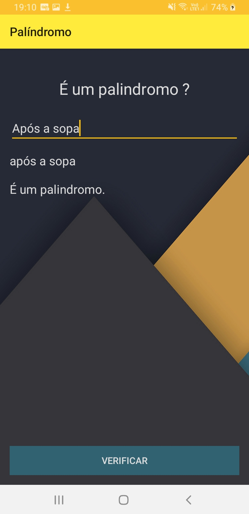
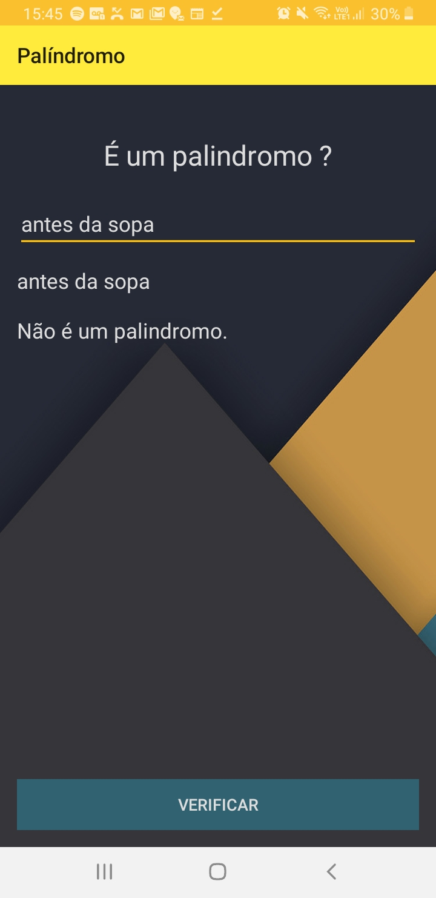

<h1 align="center">Projeto Palíndromo</h1>

<h4 align="center"> 
	  ✔️ Palíndromo 📌 Concluído 🚀 
</h4>

### 💻 Sobre o projeto

Aplicativo desenvolvido para verificar se uma palavra ou frase inteira é ou não um palindromo. 

Um **palíndromo** é uma palavra, frase ou qualquer outra sequência de unidades (como uma cadeia de [ADN](https://pt.wikipedia.org/wiki/DNA "DNA"); Enzima de restrição) que tenha a propriedade de poder ser lida tanto da direita para a esquerda como da esquerda para a direita. Num palíndromo, normalmente são desconsiderados os [sinais ortográficos](https://pt.wikipedia.org/wiki/Ortografia "Ortografia") ([diacríticos](https://pt.wikipedia.org/wiki/Diacr%C3%ADtico "Diacrítico") ou de [pontuação](https://pt.wikipedia.org/wiki/Pontua%C3%A7%C3%A3o "Pontuação")), assim como o espaços entre palavras

###### *PALÍNDROMO. In: WIKIPÉDIA: a enciclopédia livre. Wikimedia, 2020. Disponível em: <[https://pt.wikipedia.org/wiki/Pal%C3%ADndromo](https://pt.wikipedia.org/wiki/Pal%C3%ADndromo)>. Acesso em: 12 de agosto de 2020.*

### :art: Layout

##### Android

  
  

